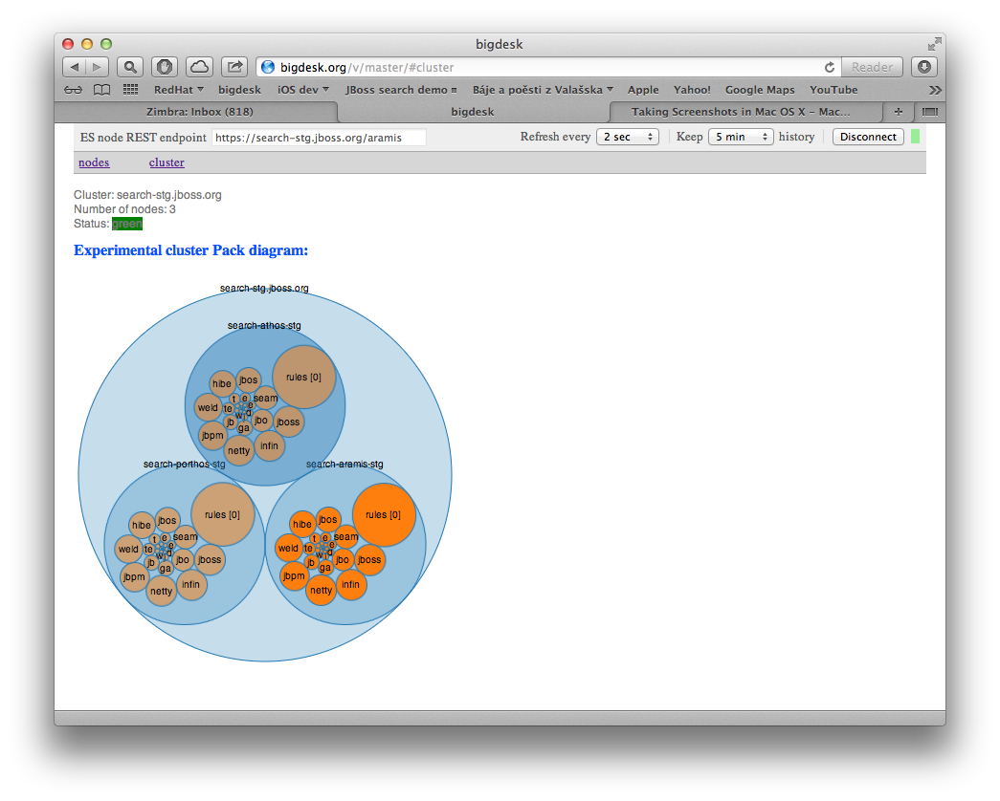
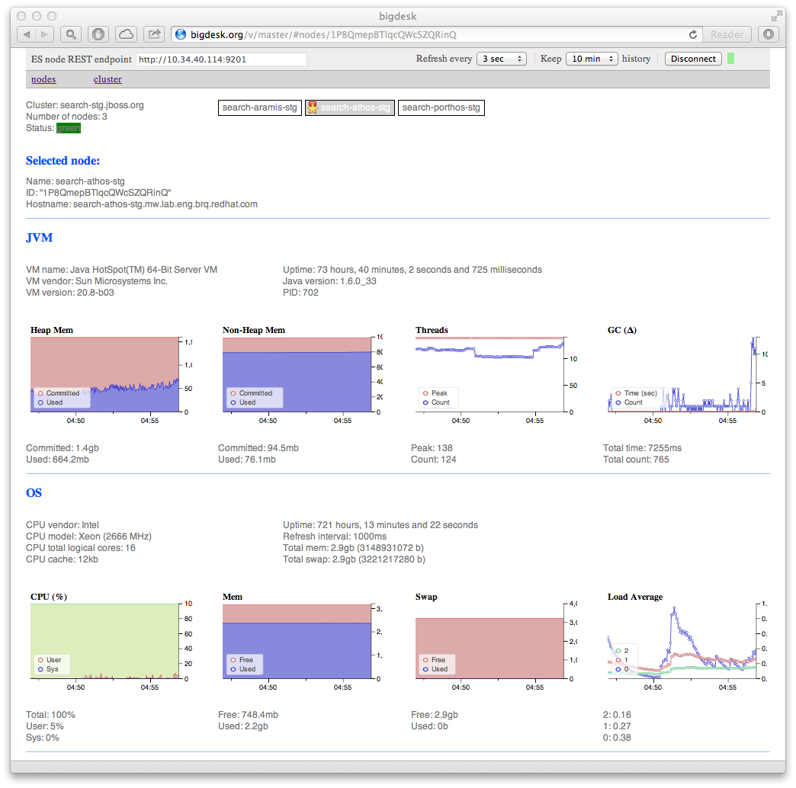
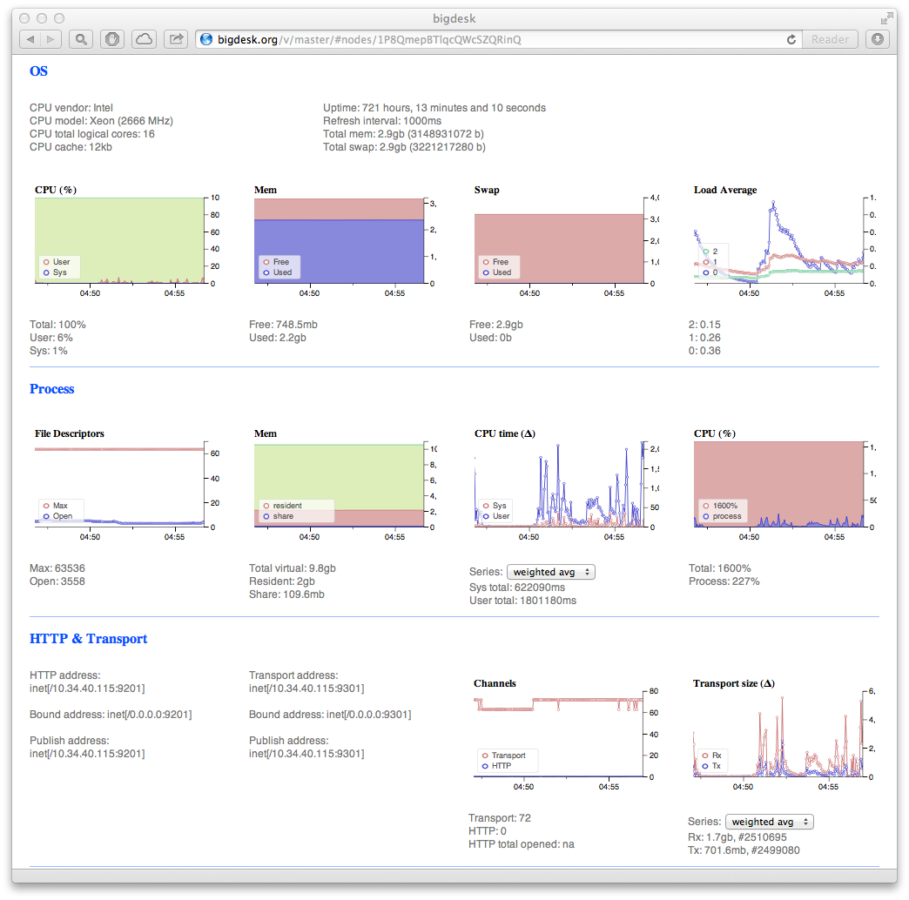
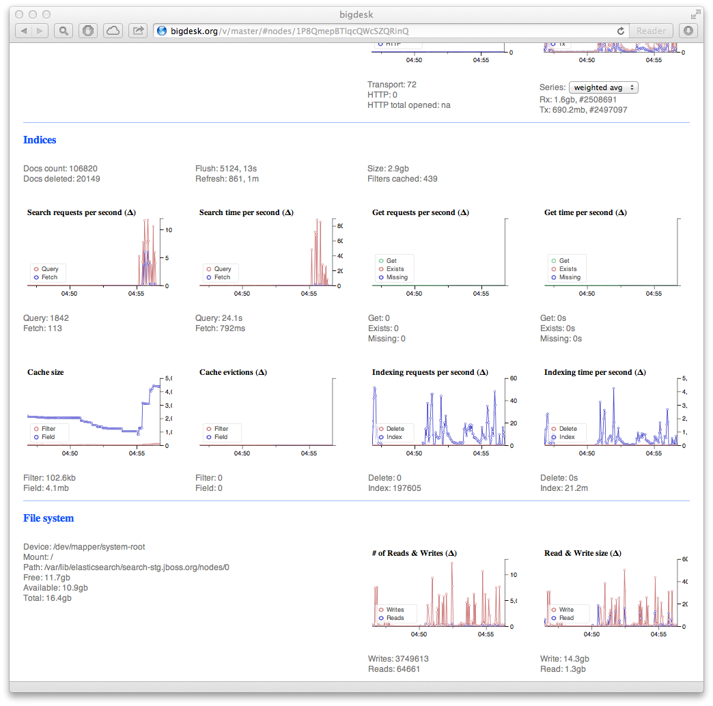
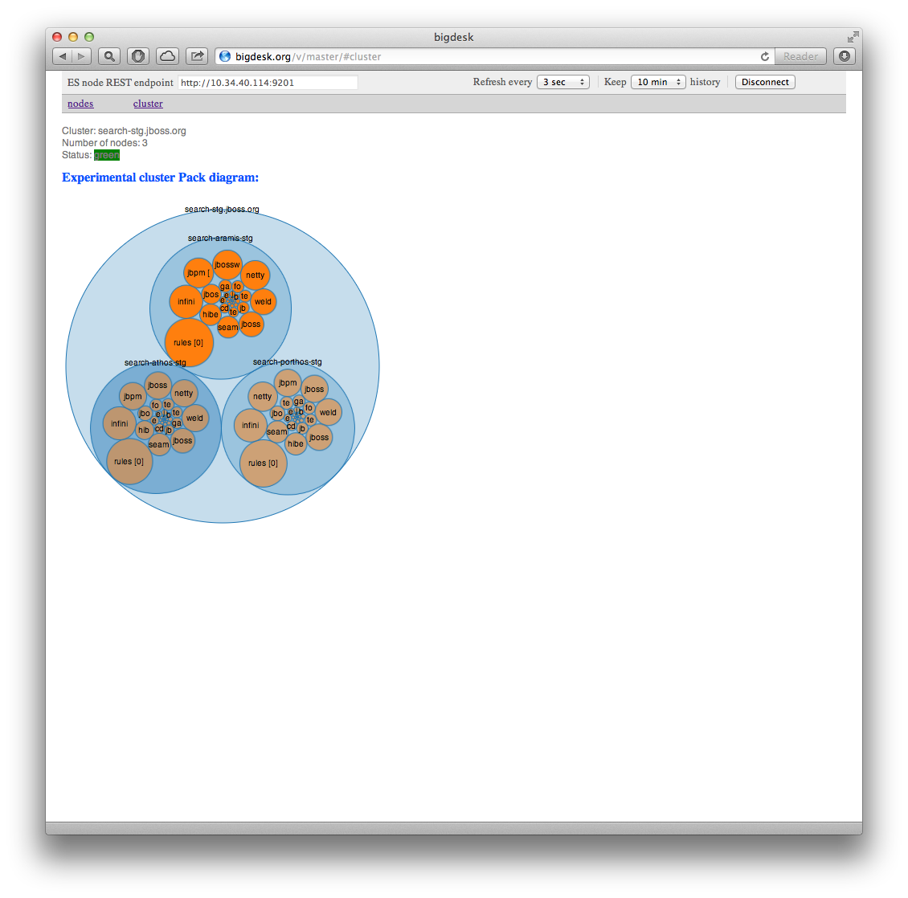

In simple words **bigdesk** makes it very easy to see how your Elasticsearch cluster is doing. Just install it as an [Elasticsearch plugin](#Elasticsearch_plugin), [download locally](#Download_locally) or run [online from the web](#Online_from_the_web), then point it to the Elasticsearch node REST endpoint and **have fun**. 

*****

<!--  -->
<!--  -->
<!--  -->

<section class="slider">
	

	  <ul class="slides">
	    <li>
	      
	    </li>
	    <!-- <li>
	      
	    </li> -->
	    <li>
	      
	    </li>
	    <li>
	      
	    </li>
	  </ul>
	

</section>

It pulls data from Elasticsearch REST API and turns it into charts.

Don't forget to check Elasticsearch [support matrix](https://github.com/lukas-vlcek/bigdesk#support-matrix) to install correct version of Bigdesk.

<a href="https://twitter.com/bigdesk_" class="twitter-follow-button" data-show-count="false">Follow @bigdesk_</a>

*****

### Elasticsearch plugin

To install the Bigdesk **master** branch as an [Elasticsearch plugin](http://www.elasticsearch.org/guide/reference/modules/plugins.html) on a particular Elasticsearch node, navigate to the node installation folder and run the following command:

	bin/plugin install lukas-vlcek/bigdesk

To install a specific version (for example **2.4.0**) run:

	bin/plugin install lukas-vlcek/bigdesk/2.4.0

Then you can navigate your web browser to `http://<elasticsearch_REST_endpoint>/_plugin/bigdesk/`

*****

### Download locally

You can either download and extract the Bigdesk archive:

- **master**: [zipball](https://github.com/lukas-vlcek/bigdesk/zipball/master), [tarball](https://github.com/lukas-vlcek/bigdesk/tarball/master)
- **2.4.0**: [zipball](https://github.com/lukas-vlcek/bigdesk/zipball/v2.4.0), [tarball](https://github.com/lukas-vlcek/bigdesk/tarball/v2.4.0)
- **2.2.3**: [zipball](https://github.com/lukas-vlcek/bigdesk/zipball/v2.2.3), [tarball](https://github.com/lukas-vlcek/bigdesk/tarball/v2.2.3)
- **2.2.2**: [zipball](https://github.com/lukas-vlcek/bigdesk/zipball/v2.2.2), [tarball](https://github.com/lukas-vlcek/bigdesk/tarball/v2.2.2)
- **2.2.1**: [zipball](https://github.com/lukas-vlcek/bigdesk/zipball/v2.2.1), [tarball](https://github.com/lukas-vlcek/bigdesk/tarball/v2.2.1)
- **2.1.0**: [zipball](https://github.com/lukas-vlcek/bigdesk/zipball/v2.1.0), [tarball](https://github.com/lukas-vlcek/bigdesk/tarball/v2.1.0)
- **2.0.0**: [zipball](https://github.com/lukas-vlcek/bigdesk/zipball/v2.0.0), [tarball](https://github.com/lukas-vlcek/bigdesk/tarball/v2.0.0)
- **1.0.0**: [zipball](https://github.com/lukas-vlcek/bigdesk/zipball/v1.0.0), [tarball](https://github.com/lukas-vlcek/bigdesk/tarball/v1.0.0)

Or you can clone the git repository from GitHub:

	git clone git://github.com/lukas-vlcek/bigdesk.git bigdesk

Then simply open `bigdesk/index.html` in your web browser.

*****

### Online from the web

You can also run Bigdesk directly from the web without needing to install it. Just [select the version](v) you want to use and you are ready to go.

*****

### URL parameters

You can use URL parameters to immediately **connect** to a particular **endpoint** or set **history** and **refresh** interval:

##### &mdash; endpoint
URL of Elasticsearch node REST endpoint (you might want to use URL encoded value). Defaults to `http://localhost:9200`.

##### &mdash; connect
If set to `true` Bigdesk will try to connect immediately to the endpoint. Defaults to `false`.

##### &mdash; refresh
Refresh interval in milliseconds. Defaults to `2000` (2 sec).

##### &mdash; history
How much data in milliseconds to keep in history. Defaults to `300000` (5 min).

For example, to open Bigdesk and have it connect to `http://127.0.0.1:9201` endpoint with a `3` sec refresh interval use:

`index.html?endpoint=http://127.0.0.1:9201&connect=true&refresh=3000`

Check [here](https://github.com/lukas-vlcek/bigdesk/blob/0.18.x/README.textile) about supported URL parameters by Bigdesk 1.0.0. 

### Web browser support

A modern web browser with SVG support is needed. It has been tested in Safari, Firefox and Chrome.

